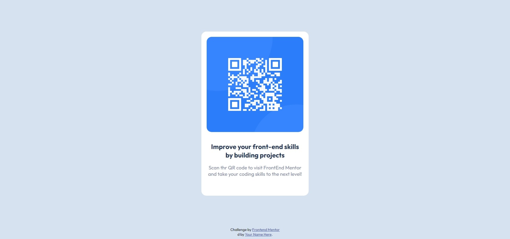

# Frontend Mentor - QR code component solution

This is a solution to the [QR code component challenge on Frontend Mentor](https://www.frontendmentor.io/challenges/qr-code-component-iux_sIO_H). Frontend Mentor challenges help you improve your coding skills by building realistic projects. 

## Table of contents

- [Overview](#overview)
  - [Screenshot](#screenshot)
  - [Links](#links)
- [My process](#my-process)
  - [Built with](#built-with)
  - [What I learned](#what-i-learned)
  - [Continued development](#continued-development)
- [Author](#author)

## Overview

### Screenshot



### Links

- Solution URL: [Add solution URL here](https://github.com/stv10/codigo-qr.git)
- Live Site URL: [Add live site URL here](https://stv10-codigo-qr.vercel.app/)

## My process

### Built with

- Semantic HTML5 markup
- CSS custom properties
- Flexbox

### What I learned

I used this challenge to practice flexbox and styling with css, i found it very useful and give me the chance to get a better knowledge about how flex containers work and resize

```html
    <main id="container">
      <div id="card">
        <div id="img-div">
          
        </div>
        <div id="desc">
          <h4>Improve your front-end skills by building projects</h4> 
          <p>Scan thr QR code to visit FrontEnd Mentor and take your coding skills to the next level!</p>
        </div>
      </div>
    </main>
```

```html
<h1>Some HTML code I'm proud of</h1>
```
```css
.proud-of-this-css {
  color: papayawhip;
}
```
```js
const proudOfThisFunc = () => {
  console.log('🎉')
}
```

### Continued development

Talking about learning i would like your advice about this breakpoints i made, it is the only way i know to make a responsive page, i am sure there is a better approach for this, with some function maybe or another tool i miss
```css
@media (max-width: 1200px) {
    #card {
        width: 23%;
    }
  }

  @media (max-width: 1100px) {
    #card {
        width: 25%;
    }
  }

  @media (max-width: 1000px) {
    #card {
        width: 27%;
    }
  }
  ```

  and like this ones i made a lot more...

## Author

- Frontend Mentor - [@stv10](https://www.frontendmentor.io/profile/stv10)
- Twitter - [@santi_V18](https://www.twitter.com/santi_v18)
